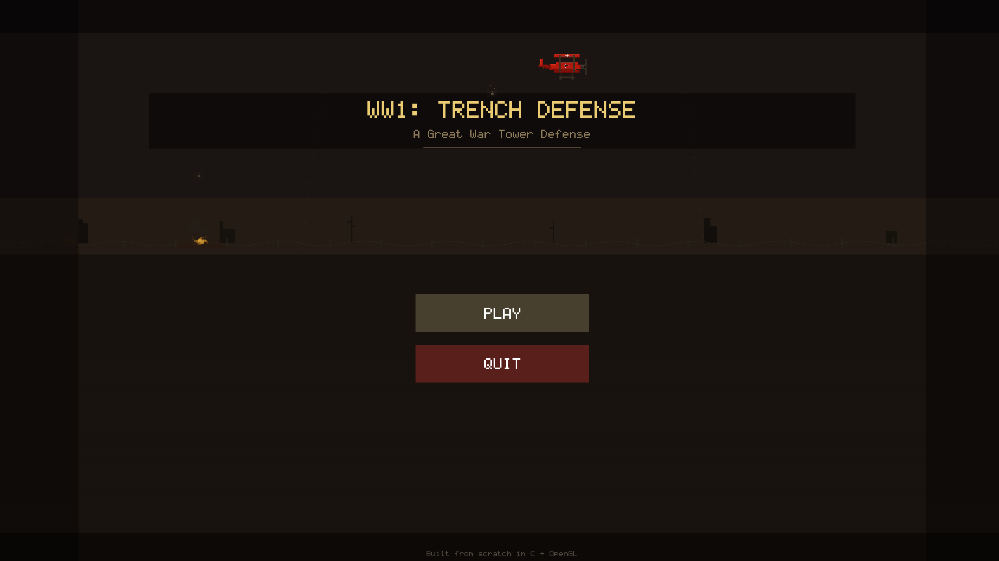
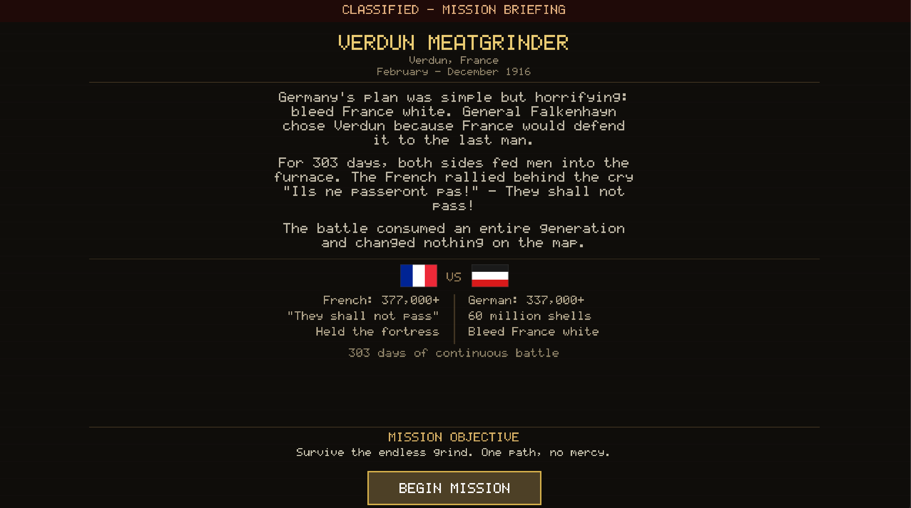
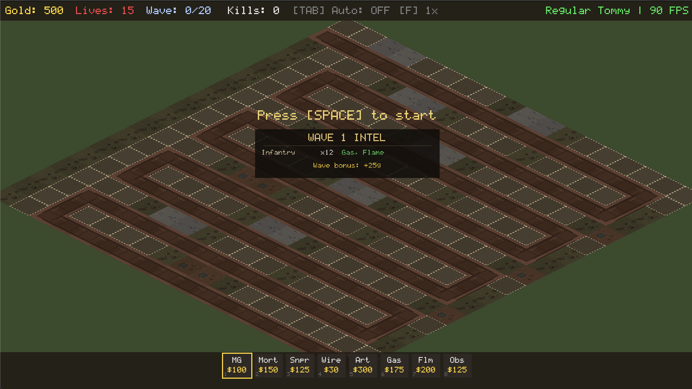

# WW1: Trench Defense

A World War 1 themed tower defense game built from scratch in C with a custom OpenGL 3.3 engine. No game frameworks, no external art — everything is procedurally generated.

## Screenshots


*The main menu, featuring a Red Baron flyby over a war-torn horizon with searchlights and distant explosions.*


*Historical mission briefings present real WW1 context, casualty figures, and national flags before each battle.*


*In-game view of the trench defense grid with tower placement bar and wave intel showing incoming enemy composition.*

## Features

- **8 Tower Types**: Machine Gun, Mortar, Sniper, Barbed Wire, Artillery (Big Bertha), Gas Dispenser, Flamethrower, Observation Balloon
- **8 Enemy Types**: Infantry, Cavalry, Stormtrooper, Mark IV Tank, Medic, Officer, Tunnel Sapper, Armored Car
- **5 Levels**: No Man's Land, Gallipoli Beach, Verdun Meatgrinder, Brusilov's Breakthrough, The Kaiserschlacht
- **4 Difficulty Modes**: Fresh Recruit, Regular Tommy, Trench Veteran, Kaiserschlacht
- **Strategic Combat**: Medics heal allies, Officers buff speed, tower targeting priority (First/Last/Strong/Weak/Near)
- **Authentic WW1 Visuals**: War-torn terrain, mortar arc trajectories, flamethrower streams, gas clouds, observation balloon with sway animation
- **Procedural Pixel Art**: All sprites generated at startup from code — no image files needed
- **Full Game Loop**: Main menu → Difficulty → Level Select → Gameplay → Pause → Victory/Defeat

## Building

### Requirements

- C11 compiler (GCC, Clang, MSVC)
- CMake 3.15+
- GLFW 3.3+ (install via package manager)

### macOS

```bash
brew install cmake glfw
cmake -B build -DCMAKE_BUILD_TYPE=Release
cmake --build build
./build/ww1td
```

### Linux

```bash
sudo apt install cmake libglfw3-dev  # Debian/Ubuntu
cmake -B build -DCMAKE_BUILD_TYPE=Release
cmake --build build
./build/ww1td
```

### Windows

```bash
# Install GLFW via vcpkg or download from glfw.org
cmake -B build -DCMAKE_BUILD_TYPE=Release
cmake --build build --config Release
```

## Controls

| Key | Action |
|-----|--------|
| **WASD** | Pan camera |
| **Scroll** | Zoom in/out |
| **1-8** | Select tower type |
| **Left Click** | Place tower / Select tower |
| **Right Click** | Sell selected tower |
| **Space** | Start next wave |
| **Tab** | Toggle auto-wave |
| **F** | Cycle speed (1x/2x/5x) |
| **Escape** | Pause |
| **F2** | Debug overlay |

## Architecture

```
src/
├── core/       Platform layer (window, input, time, memory, logging)
├── math/       Custom linear algebra (vec2/3/4, mat4, isometric helpers)
├── render/     OpenGL rendering (sprite batch, camera, shaders, procedural atlas)
├── game/       All game logic (towers, enemies, waves, projectiles, economy)
├── ui/         Immediate-mode UI with built-in pixel font
└── states/     Game state machine (menu, difficulty, level select, play, pause)
```

Dependencies flow downward: `game/` → `render/` → `core/` → `math/`. Never upward.

## Tech Stack

| Component | Choice |
|-----------|--------|
| Language | C11 |
| Graphics | OpenGL 3.3 Core |
| Windowing | GLFW |
| GL Loader | GLAD (generated) |
| Image Loading | stb_image |
| Build | CMake |
| Math | Custom |
| Memory | Arena allocators |

## License

MIT — see [LICENSE](LICENSE)
